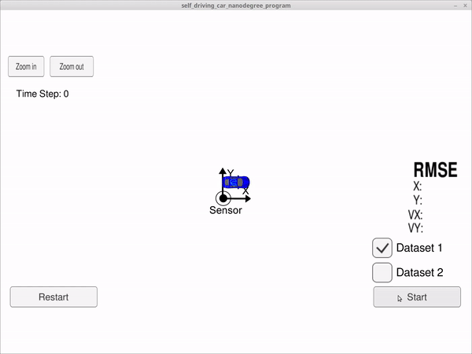

# self-driving-car

In this repository I will share the **source code** of all the projects of **[Udacity Self-Driving Car Engineer Nanodegree](https://www.udacity.com/course/self-driving-car-engineer-nanodegree--nd013)**.
## Capstone Project
The car drives on itself following the basic rules of driving, detecting traffic light and classifying it. It makes decision on its based on the behavious programmed. In our case it is following the traffic rules.

## Overview

### Projects

<table style="width:100%">
  <tr>
            <th>

           
            P2: Traffic Signs
            <a href="./assets/readme/Trafficlight.md" name="p2_code">(code)</a>
        

    </th>
            <th>

           
            P4: Adv. Lane Finding
            <a href="./assets/readme/LaneDetection.md" name="p4_code">(code)</a>
        

    </th>
  </tr>
  <tr>
            <th>

           
            P6: Ext. Kalman Filter
            <a href="./assets/readme/KalmanFilter.md" name="p6_code">(code)</a>
        

    </th>
            <th>

     
            P8: Kidnapped Vehicle
            <a href="./assets/readme/ParticleFilter.md" name="p8_code">(code)</a>
        

    </th>
  </tr>
  <tr>
            <th>

           
            P9: PID Controller
            <a href="./assets/readme/PID_Control.md" name="p9_code">(code)</a>
        

    </th>
            <th>

           
            P11: Path Planning
            <a href="./assets/readme/Path_planning.md" name="p11_code">(code)</a>
        

    </th>
  </tr>
</table>

### Capstone

- [**Traffic light classifier:**](https://github.com/amancodeblast/self-Driving-car/blob/master/assets/readme/Trafficlight.md) Simple traffic light classifier to be integrated in the capstone project.
  

---

## Table of Contents

#### [P1 - Traffic Sign Classification](./assets/readme/Trafficlight.md)

 - **Summary:** Built and trained a deep neural network to classify traffic signs, using TensorFlow. Experimented with different network architectures. Performed image pre-processing and validation to guard against overfitting.
 - **Keywords:** Deep Learning, TensorFlow, Computer Vision

#### [P2 - Advanced Lane Finding](./assets/readme/LaneDetection.md)

 - **Summary:** Built an advanced lane-finding algorithm using distortion correction, image rectification, color transforms, and gradient thresholding. Identified lane curvature and vehicle displacement. Overcame environmental challenges such as shadows and pavement changes.
 - **Keywords:** Computer Vision, OpenCV

 - 

 #### [P3 - Extended Kalman Filter](./assets/readme/KalmanFilter.md)

 - **Summary:** Implement the extended Kalman filter in C++. Simulated lidar and radar measurements are used to detect a bicycle that travels around your vehicle. Kalman filter, lidar measurements and radar measurements are used to track the bicycle's position and velocity.
 - **Keywords:** C++, Kalman Filter

 #### [P3.5 - Unscented Kalman Filter](./assets/readme/KalmanFilter.md)

 - **Summary:**  Utilize an Unscented Kalman Filter to estimate the state of a moving object of interest with noisy lidar and radar measurements. Kalman filter, lidar measurements and radar measurements are used to track the bicycle's position and velocity.
 - **Keywords:** C++, Kalman Filter

  #### [P4 - Kidnapped Vehicle](./assets/readme/ParticleFilter.md)

 - **Summary:** Your robot has been kidnapped and transported to a new location! Luckily it has a map of this location, a (noisy) GPS estimate of its initial location, and lots of (noisy) sensor and control data. In this project you will implement a 2 dimensional particle filter in C++. Your particle filter will be given a map and some initial localization information (analogous to what a GPS would provide). At each time step your filter will also get observation and control data.
 - **Keywords:** C++, Particle Filter

 #### [P5 - PID Control](./assets/readme/PID_Control.md)

 - **Summary:** Implement a PID controller for keeping the car on track by appropriately adjusting the steering angle.
 - **Keywords:** C++, PID Controller

#### [P6 - Path Planning](./assets/readme/Path_planning.md)

- **Summary:** The goal in this project is to build a path planner that is able to create smooth, safe trajectories for the car to follow. The highway track has other vehicles, all going different speeds, but approximately obeying the 50 MPH speed limit. The car transmits its location, along with its sensor fusion data, which estimates the location of all the vehicles on the same side of the road.
- **Keywords:** C++, Path Planning

  

